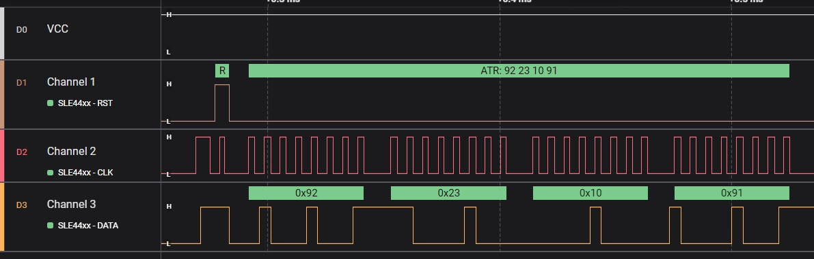
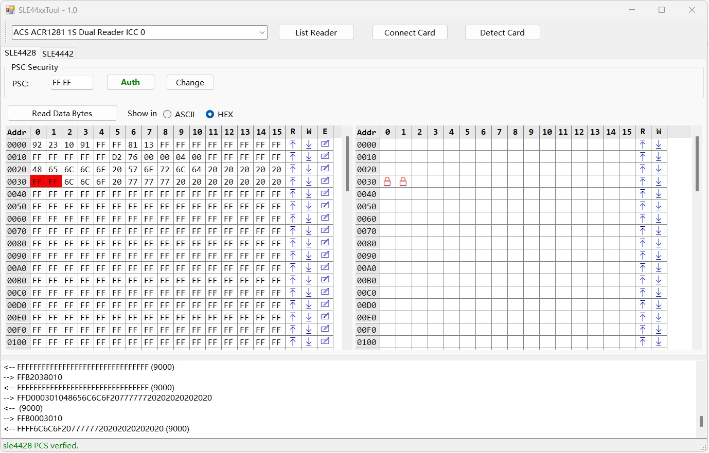
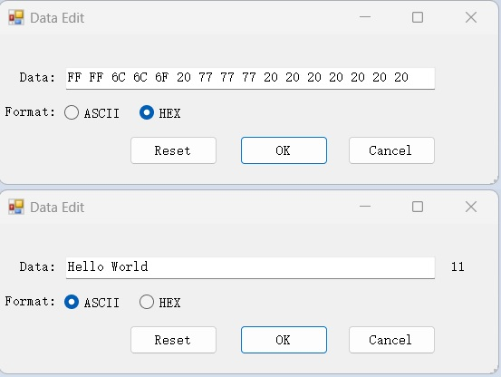

# sle44xx_csharp

manage sle4428/sle4442 synchronous in winform

This program is based on acs and hid readers` reference sample code, and the 
UI is inspired by the 'Understanding Contact Cards' from Sanga Chidam.

- sle4428 is working, sle4442 is under development
- acs acr1581u, acr39u, acr1281u tested
- hid ok3121, ok3021, ok5422 is under development

> please note: the ok3x21 latest version (2021) is compatible with 'plt-03099-omnikey contact reader sw dev guide', and the old version(2006) is is not.

> hid reader is slower than acs':

| Reader | Frequence(Hz) | load sle4428 1k data |
|-------|-------|-------|
| ACR39u | 40k | 588ms |
| ACR1281u | 150k | 194ms |
| ACR1581u | 124k | 220ms |
| ok5422 | 33k | / |
| ok3121 | 33k | / |

> Here is an example RESET logic for sle4428

> Application Main Window

> Data Edit Window

----
.NFC 2024/08/30
